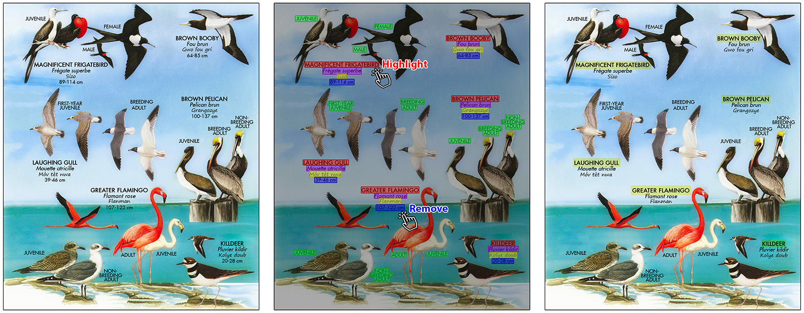

# Learning Multimodal Affinities for Textual Editing in Images

This is the official implementation code accompanying the paper: 
["Learning Multimodal Affinities for Textual Editing in Images"](https://arxiv.org/abs/2103.10139), presented in SIGGRAPH 2021.

***Note: Due to size limitations some of the mentioned files are missing and will be added soon: ***
- Pretrained Font Embedder model, under `/models/resnet_font_classifier.pth`



## Installation

An installation of conda is required.
Tested with CUDA 10.1, Ubuntu 18.

```shell script
git clone multimodal-affinities
cd multimodal-affinities
conda create --name multimodal python=3.6
conda activate multimodal
make
```

## Preliminaries

### OCR Engine & Input Format

Due to licensing issues, and to avoid coupling with any specific OCR engine, 
the pipeline assumes OCR engine output json as input.

The first block of the pipeline consists of an off the shelf OCR engine which extracts words & lines locations,
as well as word transcriptions from some image input.

Practitioners may use the following OCR engines:
- [Tesseract](https://github.com/tesseract-ocr/tesseract) - Open Source
- [Textract](https://aws.amazon.com/textract/) - Commercial Software

The input json format is assumed to be converted to the following format example:

```json
{
   "objects":[
      {
         "text":{
            "content":"WORD TEXT HERE",
            "score": 1.0
         },
         "score": 1.0,
         "type":"Word",
         "bbox":{
            "vertices":[
               {
                  "y":332,
                  "x":135
               },
               {
                  "y":332,
                  "x":167
               },
               {
                  "y":344,
                  "x":167
               },
               {
                  "y":344,
                  "x":135
               }
            ]
         }
      },
      {
         "score": 1.0,
         "type":"Line",
         "bbox":{
            "vertices":[
               {
                  "y":373,
                  "x":87
               },
               {
                  "y":373,
                  "x":300
               },
               {
                  "y":388,
                  "x":300
               },
               {
                  "y":388,
                  "x":87
               }
            ]
         }
      }
   ],
   "imageSize":{
      "width":386,
      "height":756
   }
}
```

Where the following syntax rules apply:
1. The root of the json contains an "objects" key, with a list value of all 'Word' & 'Line' detections.
   1. All objects should contain a "type" field with value of 'Word' or 'Line'.
   2. All objects should contain a "bbox" field, with a 'vertices' sublist, 
   containing the "x" and "y" locations for each of the Word / Line bounding box corners: 
   top-left, top-right, bottom-right, bottom-left.
   3. All objects should contain a "score" field, between 0.0 and 1.0, which describes the detection confidence.
   4. 'Word' objects may contain a "text" field, with a "contents" subfield containing the word's transcription.
   An optional 'score' field may exist here for the transcription confidence, which is ignored by the pipeline.
2. The root of the json contains an "imageSize" entry, with 'width" and 'height' subfields describing the image dimensions in pixels.

The pipeline will ignore any additional fields included within the object list.
The module depicted in ` ocr_preprocess.py` contains logic which uses 'Line' annotations and 'score' fields to eliminate noisy detections.
Naturally, OCR engines of varying quality may require different parameter tuning here.

At the end of the OCR preprocess step, the pipeline will process only 'Word' detections of plausible quality.

### Font Embedder
`/multimodal_affinities/font_classifier` contains the code and configuration used to train the font embedder used in the paper.

The font embedder is a ResNet classifier, trained to predict the following labels:
- Font Family
- Italic / Bold classification
- Lower case / all caps

The synthetic data generator used to train the font embedder is available at 
[TextRecognitionDataGenerator](https://github.com/Belval/TextRecognitionDataGenerator).

\* A pretrained font embedder is available at `/models/resnet_font_classifier.pth`

\*\* A small sample dataset is available at `/datasets/fonts` 
(the full synthetic dataset is 20GB).

## Inference

### Via Command line

```shell script
python run_inference.py -i IMG_PATH [-c OCR_JSON_PATH] [-g CONFIG_PATH] [-o OUTPUT_PATH] [-np] [-na]
```

The script will print the discovered clusters to the console, as well as generate visualizations under the output path.
Use the -np and -na flags to turn visualizations off.

When running the script for the first time,
please allow 5-10 minutes for the inference script to download required pretrained models.

### Via Code

```/multimodal_affinities/pipeline/algorithm_api.py``` exposes the core logic required to run this work.

A full pipeline run may be obtained by using the following sample function:
```python 
import logging
from multimodal_affinities.pipeline.algorithm_api import CoreLogic

def run_algorithm(doc_ocr_json_path, doc_img_path, algorithm_config):
    logger = logging.getLogger('multimodal')
    core_logic = CoreLogic(logger)
    document = core_logic.run_full_pipeline(doc_ocr_json_path=doc_ocr_json_path,
                                            doc_img_path=doc_img_path,
                                            algorithm_config=algorithm_config)
    return document
``` 

A default ```algorithm_config``` used to obtain the paper results is available within ```/config/algorithm_config.json``` 

_Note: within algorithm_config -- the entry `embeddings_initialization.font_embeddings.trained_model_file` should be updated to point at the correct font embedder model .pth path._


## Test Data

Due to legal constraints, we're currently unable to publicly release the complete test set used in this publication.

Practitioners may run the paper code on their own document images.
Make sure to pre-processing the images using an OCR engine according to the format described above (Tesseract, Textract).


## Running the GUI server

The algorithm was tested and tuned via a web interface.
The gui also allows users to apply user constraints, as well as refine results.
As sanity check, make sure you're able to run the algorithm via the command line.


### Option I: Run server from console

Recommended way for most test runs.

```shell script
cd multimodal-affinities/multimodal_affinities
source run_bokeh.sh
```

The server console should look like so:
```text
bokeh serve bokeh_server/server_abstract.py
2018-11-26 08:08:49,293 Starting Bokeh server version 0.12.15 (running on Tornado 5.0.2)
2018-11-26 08:08:49,296 Bokeh app running at: http://localhost:5006/server_abstract
```

To connect as a client: browse the website link printed on the server console.

### Option II: Run server from PyCharm

Useful for debugging.
Setup a new PyCharm run configuration as follows -

Script path (example follows Linux):
```shell script
/home/ubuntu/anaconda3/envs/multimodal/bin/bokeh
```

Parameters:
```shell script
serve bokeh_server/server_abstract.py
```
 
To connect as a client: browse the website link printed on the server console.


## Citation

If you use this code for your research, please cite our paper.

```bibtex
@article{10.1145/3451340,
author = {Perel, Or and Anschel, Oron and Ben-Eliezer, Omri and Mazor, Shai and Averbuch-Elor, Hadar},
title = {Learning Multimodal Affinities for Textual Editing in Images},
year = {2021},
issue_date = {July 2021},
publisher = {Association for Computing Machinery},
address = {New York, NY, USA},
volume = {40},
number = {3},
issn = {0730-0301},
url = {https://doi.org/10.1145/3451340},
doi = {10.1145/3451340},
journal = {ACM Trans. Graph.},
month = jul,
articleno = {26},
numpages = {16},
keywords = {multimodal representations, document images, Image editing, clustering, vision and language, infographics}
}
```

## License
multimodal-affinities is released under the Creative Commons Attribution 4.0 International license. See the [LICENSE](LICENSE) and [THIRD-PARTY-NOTICES.txt](THIRD-PARTY-NOTICES.txt) files for more information.